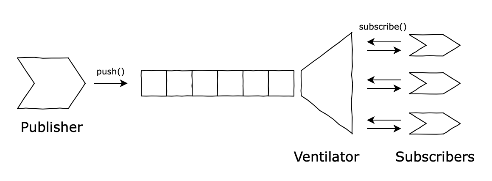
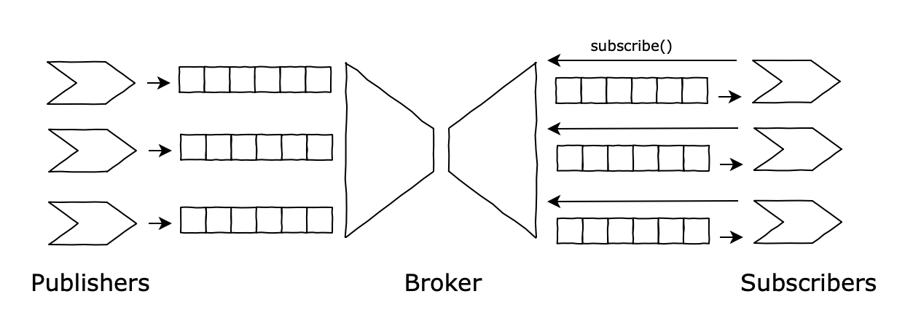
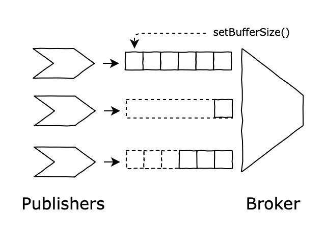

# Info.Sec.C00k3r

> **To develop an application that supports the creation and execution of Information Security Recipes.**
The base unit of computation in this application is a Task. Tasks are comprised of (a) a set of inputs, (b) a set of outputs, and (c) an inherent behaviour. One can compose tasks by arbitrarily connecting their inputs and outputs to form a Recipe. There's a standard collection of tasks that we can already foresee, but the application should be extensible enough to support new tasks via plugins without altering the base code. Recipes can be saved and reused as tasks in other recipes.

Refer to the class slides for more information.

## Part I (class of 25/3/2019)

> In software engineering, a **pipeline** consists of a **chain of processing elements** (processes, threads, coroutines, functions, etc.), arranged so that the output of each element is the input of the next; the name is by analogy to a physical pipeline. Usually some amount of buffering is provided between consecutive elements. The **information that flows** in these pipelines is often a **stream** of records, bytes, or bits, and the elements of a pipeline may be called **filters**; this is also called the **pipes and filters design pattern**. Connecting elements into a pipeline is analogous to function composition.

* *Pull* architecture, from the point of view of tasks (tasks *demand* data);
* Synchronous and Blocking;
* Eager instead of Lazy (see `FileLineReader`);
* No orchestrator (`iterate()` is lost in the hyperspace and there's no notion of recipe execution).

End of class challenges (do a PR if you address them):

* Refactor the solution to become asynchronous (*push* with promises? use `async/await` ?);
* Lazify the sources (`FileLineReader` should support files larger than available RAM);
* Add new filters (some of them were left commented out);
* Implement `Fork` (send the same output to multiple blocks; what should be its API? And semantics? Fanout? Round-robin?);
* **(To meditate)** Do we really want/need an `iterate()`?

For those that were not paying attention (or feel lost):

* Be aware that we are implementing a [Pipes-and-Filters](https://www.youtube.com/watch?v=6UrF1E2kSas) based solution;
* Study mechanisms of [Data-flow](https://en.wikipedia.org/wiki/Dataflow) and [Control-Flow](https://en.wikipedia.org/wiki/Control_flow);
* Study the [Iterator](https://en.wikipedia.org/wiki/Iterator_pattern) and [Null Object](https://en.wikipedia.org/wiki/Null_object_pattern) Patterns;
* Understand what's a [Stream](https://en.wikipedia.org/wiki/Stream_(computing));
* Study [Callbacks](https://en.wikipedia.org/wiki/Callback_(computer_programming)), Promises [[1](https://javascript.info/promise-basics), [2](https://javascript.info/promisify), [3](https://javascript.info/microtask-queue)] and [Async/Await](https://javascript.info/async-await).

## Part II (class of 1/4/2019)

> In software architecture, **publish–subscribe** is a **messaging pattern** where senders of messages, called publishers, do not program the messages to be sent directly to specific receivers, called subscribers, but instead categorize published messages into classes **without knowledge of which subscribers**, if any, there may be. Similarly, subscribers express interest in one or more classes and only receive messages that are of interest, without knowledge of which publishers, if any, there are. **Publish–subscribe is a sibling of the *message queue* paradigm, and is typically one part of a larger message-oriented middleware system.** This pattern provides greater network scalability and a more dynamic network topology, with a resulting decreased flexibility to modify the publisher and the structure of the published data.

Let's try to understand how we can get from where towards the above architectural pattern.

---

### 1st Scenario


* Unbounded queue;
* Publisher sends messages a.s.a.p.;
* Subscriber tries to pull messages and blocks (`awaits`) until it has one;
* *Implicit* subscription (fetch directly from data structure).

#### Potential problems

* Possible out-of-memory in queue;
* Publisher produces work even if no subscriber exists (eager);
* When does the subscriber *consume* (removes) the message from the queue? Right away? When it finishes the work? What if it fails after removing and before finishing its work?

---

### 2nd Scenario


* Unbounded queue and publishes asap (again);
* Multiple subscribers:
    * They pull messages concurrently;
    * Each gets a different message;
* *Implicit* subscription (fetch from data structure).

#### Potential problems:

* Possible out-of-memory in queue (again);
* Eager producer (again);
* No guarantees on delivery-order, or load-balancing;
* Potentially *loses* messages if they are consumed asap;
* Potentially *duplicates* messages if they are consumed only after subscriber finishes work.

---

### 3rd Scenario



* Unbounded queue and publishes asap (again);
* *Ventilator* (or Subscription Manager) knows about the subscribers:
    * [Observer](https://en.wikipedia.org/wiki/Observer_pattern) used to push to subscribers (*Explicit* subscription);
    * Different specializations of *ventilators* ([Fanout](https://en.wikipedia.org/wiki/Fan-out_(software)), Round-robin...).

#### With steroids:

* Understands receipt notification (**ACK**) from subscribers;
* May use [Heart Beat](https://en.wikipedia.org/wiki/Heartbeat_(computing)), [Timeout](https://en.wikipedia.org/wiki/Timeout_(computing)) and [Circuit breaker](https://martinfowler.com/bliki/CircuitBreaker.html) patterns to deal with delivery failures;
* Manages message meta-information, such as marking them as *tentatively consumed*, until it has such guarantees (e.g., to avoids losing messages).

#### Potential problems:

* Complex logic and internal state;
* Internal failure may lead to lost and/or duplicated messages;
* Publishers are still eager.

----

### 4th Scenario



* Multiple publishers, multiple subscribers;
* Both have specialized queues:
    * Inbound and Outbound;
    * Broker manages queue binding;
    * Broker moves messages around (between queues);
    * Queues may be persistent;
* No implicit connections between subscribers and producers:
    * *Explicit* subscription;
    * Identification mechanism is needed (keys, topics, ...);
    * Study the [Registry](https://martinfowler.com/eaaCatalog/registry.html) and (if you are feeling adventurous) the [Service Locator](https://en.wikipedia.org/wiki/Service_locator_pattern) patterns.

#### Potential Problems:

* Single point of failure ([SPOF](https://en.wikipedia.org/wiki/Single_point_of_failure)) for any combination of publisher/subscriber;
* Performance bottleneck;
* Eagerness is **still** a problem. **(To meditate)** Did we really lost the capability to signal backwards?
* What happens if there are no subscribers?
* What happens to outbound channels if a subscriber dies?

----
### In Praise of Idleness ([Book](https://www.amazon.com/Praise-Idleness-Routledge-Classics-46/dp/0415325064))

* By **eager** we mean that the publisher performs *work* independently from (a) existing subscribers or (b) having them willing to process messages;

* By **lazy** we mean that the publisher only does the necessary amount of work to meet the subscriber *needs*.

These are sometimes also called *hot* and *cold* Observables, as described [here](http://reactivex.io/documentation/operators/backpressure.html):

* A **Cold Observable** emits a particular sequence of items, but can begin emitting this sequence when its observer finds it to be convenient, and at whatever rate the observer desires, without disrupting the integrity of the sequence.

* A **Hot Observable** begins generating items to emit immediately when it is created. Such an Observable emits items at its own pace, and it is up to its observers to keep up. 

Most existing frameworks avoid the problem of supporting both simultaneously, and stick to a single philosophy (which is a shame). Understanding these notions is key to understanding [backpressure](http://reactivex.io/documentation/operators/backpressure.html) mechanisms.

### A simple solution to cope with laziness



* By managing the size of the queue (buffer), one can block the publisher from producing a message.
* Different buffers allow independent rates of production;
* Laziness of the publisher is coupled with its ability of *not performing work* if it can't publish messages;
* But... how does the Broker know the appropriate buffer size?
    * Rate of consumption analysis, by timing the outbound queues. What about the initial size? What about (potential) unnecessary production until the buffer fills in?
    * Explicit signal from subscribers back to publishers. What should be the *unit of demand*? How does the signal propagate?

## Exercises

> **Warning.** Asynchronous programming is hard for the human brain. Testing it is even harder. **Single-threaded asynchronous event-loop-based programming is... mental!** You'll make a lot of mistakes; that's normal and part of the learning process. But the web is built on top of javascript, so it's hard to run away from it.

Attempt to replicate every scenario described above. If feeling lost, then try to proceed as follows:

1. First ensure that if you're on javascript/node.js land, your "main entry" looks like this:

    ```
    setInterval(() => { }, 1000); // run program until explicit exit
    
    (async () => {
        // Do your stuff here
        process.exit()
    })()
    ```

    And yes, this is the time you throw in the towel and learn a proper language like [Scala](https://www.scala-lang.org).

1. Implement an `AsyncQueue`, i.e., an asynchronous unlimited [FIFO](https://en.wikipedia.org/wiki/Queue_(abstract_data_type)). Start with the following public API:

    ```
    interface AsyncQueue<T> {
        enqueue(): void
        async dequeue(): Promise<T>
    } 
    ```

    If you want to test your implementation, [you can use this code](https://gist.github.com/hugoferreira/91429f413761f62ec4020a3fe9744aeb) (run multiple times or put a loop there). Just plug in your `AsyncQueue`, and don't forget to `npm install is-array-sorted` as per the dependency.

1. Realize that the implementation of an `AsyncSemaphore` would make things easier, by studying the [producer-consumer problem](https://en.wikipedia.org/wiki/Producer–consumer_problem):

    ```
    interface AsyncSemaphore {
        signal(): void
        async wait(): Promise<void>
    }
    ```

1. Implement a `BoundedAsyncQueue`, i.e. an asynchronous bounded FIFO, that blocks `enqueuing()` when it's full, and blocks `dequeuing()` when it's empty. Design your own tests based on the aforementioned *gist*:

    ```
    interface BoundedAsyncQueue<T> {
        async enqueue(): Promise<void>
        async dequeue(): Promise<T>
    } 
    ```
    
    Realize that the `enqueue()` signature changed (*w.r.t.* `AsyncQueue`). Why?

1. **(To meditate)** What should be the semantics of a zero-length queue?

1. Implement the [Observer](https://en.wikipedia.org/wiki/Observer_pattern) pattern on top of the `BoundedAsyncQueue` towards a [publish/subscribe](https://en.wikipedia.org/wiki/Publish–subscribe_pattern) architecture. **Then meditate on:**

   * `ObservableBoundedAsyncQueue` via *composition* or *inheritance*?
   * What's the notification? A *signal* or *the message*?
   * [Fanout](https://en.wikipedia.org/wiki/Fan-out_(software)) or *first-come, first-served*?
   * Compare what you've just implemented with the [Observable](http://reactivex.io/documentation/observable.html) pattern, and while you're at it, ponder over the following table:

        |          | Single   | Multiple   |
        |----------|----------|------------|
        | **Pull** | Function | [Iterator](https://en.wikipedia.org/wiki/Iterator_pattern)   |
        | **Push** | [Promise](https://en.wikipedia.org/wiki/Futures_and_promises)  | [Observable](http://reactivex.io/documentation/observable.html) |

1. Realize you've now built the basis for explicit pipes. Refactor the project to support them.

## General Notes on Pub/Sub Architectures

* **Queues provide a buffer to cope with sudden spikes**. Data messages added to a queue are stored and held to be processed later. As a result, adding messages to the queue is completely decoupled from subscribers wishing to take messages off the queue. So if subscribers cannot keep up, the queue simply grows and the workers are given some breathing room and as much time as they need to catch up.

* **Queues may fan work out by releasing each message only once.** Unlike fanout channels which deliver messages to any number of subscribers, queues will only deliver the message on the queue to one subscriber. As such, if you have 10 workers processing 5k messages per second, each will receive 500 of those messages per second. Therefore, each worker can process the data it receives without having to worry about whether other workers have received and processed the same data. This allows the workers to be designed in a more straightforward stateless way.

* **First in first out**. Queues by default operate using FIFO which means first in, first out. This approach ensures that if a backlog of messages build up, the oldest messages are processed first.

* **Queues are real time in nature**. If your subscribers pick messages off the queue at the rate they are added, then the additional latency added should be in the low milliseconds. So in practical terms, a queue does not add latency.

* **Data integrity**. If a worker picks a message off the queue, but does not send an acknowledgement of the message being successfully processed, then after a short period the message will become available on the queue again to be processed by the next available worker. This feature ensures that messages are never lost.

#### As you've observed (pun intended), there are several options related to the semantics of message passing:

* **Durability**. Messages may be kept in memory, written to disk, or even committed to a DBMS if the need for reliability indicates a more resource-intensive solution;

* **Security policies**. Which applications should have access to these messages?

* **Message purging policies**. Queues or messages may have a *time to live*;

* **Message filtering**. Some systems support filtering data so that a subscriber may only see messages matching some pre-specified criteria of interest;

* **Delivery policies**. Do we always need to guarantee that a message is delivered *at least once*? What about when we **really** need to guarantee *no more than once*?

* **Batching policies**. Should messages be delivered immediately? Or should the system wait a bit and try to deliver many messages at once?

* **Queuing criteria**. When should a message be considered "enqueued"? When one queue has it? Or when it has been forwarded to at least one remote queue? Or to all queues?

* **Receipt notification**. A publisher may need to know when some or all subscribers have received a message.
